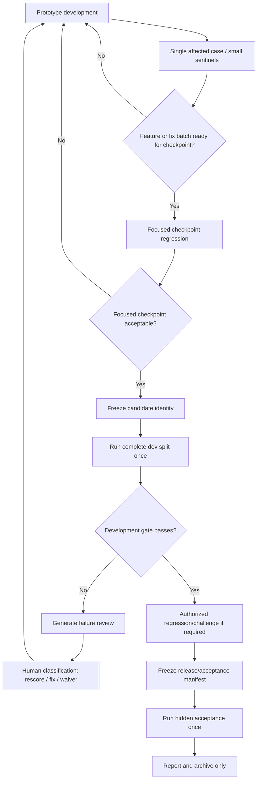

# PANDA QA Agent — Evaluation Policy

This document defines the stable evaluation rules for PANDA Agent.

It intentionally excludes transient candidate status, dated benchmark results, current failure counts, current hashes, and token totals. Those belong in `docs/EVALUATION_STATUS.md`.

The purpose of this policy is to preserve evaluation integrity while keeping the normal development loop fast and economical.

---

## 1. Core principles

1. **Development and formal evaluation are different activities.**
   Ordinary development optimizes iteration speed. Formal evaluation measures a deliberately frozen candidate.

2. **Modify one layer, validate the affected layer.**
   Test the direct dependency closure of the change, not the whole system by default.

3. **Model-backed evaluation is expensive.**
   Use deterministic/offline checks whenever they can answer the question.

4. **Full benchmark runs are checkpoint operations.**
   A full dev run is not a routine post-edit test.

5. **Acceptance is not a development set.**
   Hidden acceptance results must never be used for targeted tuning.

6. **Existing immutable records are valuable.**
   If behavior did not change, rescore/recompute offline instead of regenerating answers.

7. **Diagnostic subsets are not complete gates.**
   A subset, composite, focused run, or incomplete run can diagnose behavior but cannot represent a complete development/acceptance result.

---

## 2. Evaluation layers

Use the following validation ladder.

### Level 0 — Static inspection

Examples:

- inspect `git diff`;
- syntax/format checks directly relevant to the change;
- deterministic schema/config validation;
- targeted unit tests.

Model calls: **0**.

Use this by default for non-behavioral changes.

### Level 1 — Single affected case

For a local model-backed behavior change, run the most directly affected Gold case.

Model calls: minimal.

This is the default inner-loop validation for prototype debugging.

### Level 2 — Small sentinel check

After the affected case passes, optionally add **1–2 directly related cases/sentinels** when there is a meaningful regression risk.

Do not add sentinels mechanically.

### Level 3 — Focused checkpoint regression

Use a broader focused set when:

- a feature/debugging batch is complete;
- several related cases were changed;
- the change affects shared behavior;
- a prompt/model/routing/retrieval change has wider scope;
- the user explicitly asks for a checkpoint.

Typical size: **5–12 cases**.

Expand up to **20 cases** only for genuinely broad cross-module, global-prompt, model-configuration, or multi-intent changes.

A focused checkpoint is still diagnostic and does not pass a complete development gate.

### Level 4 — Frozen-candidate full dev

Run the complete dev split only after a candidate is intentionally frozen for formal measurement.

### Level 5 — Regression/challenge

Run only when authorized by the current benchmark lifecycle and the preceding required gate has passed.

### Level 6 — Hidden acceptance

Run only against a fully frozen release candidate under the acceptance rules in this document.

---

## 3. Change-to-validation matrix

| Change | Default validation | Optional downstream validation | Do not automatically run |
|---|---|---|---|
| Documentation/comments/report formatting/UI text | diff + directly relevant format/link check | none | model calls, hashes, QA/retrieval |
| Deterministic evaluator/scorer/report/gate | targeted unit tests + offline report/rescore | broader deterministic tests if needed | regenerate answers |
| Gold schema/selector/status policy | validation + offline rescore of existing records | targeted deterministic sentinels | full QA generation |
| Corpus/parser/manifest | affected parser/storage checks | affected retrieval case(s) | full QA |
| Index schema/embedding/index identity | rebuild/verify only the affected index | targeted retrieval + a few QA sentinels | direct acceptance |
| Query analyzer/intent/query expansion/planner | affected case first | 1–2 adjacent-intent sentinels; checkpoint set if broad | full dev |
| Retrieval channel/fusion/rerank/graph/workflow | affected evidence-group case first | 1–2 QA downstream sentinels; checkpoint set if broad | full QA |
| Answer prompt/sufficiency/claim verifier/revision/rendering | affected QA case first | 1–2 cross-intent sentinels; checkpoint set if broad | full retrieval/full dev |
| Generation model/major generation parameters | representative per-intent checkpoint | expand up to 20 if needed | full dev before freeze |
| Shared architecture/cross-cutting behavior | targeted unit/module tests + representative checkpoint | broader targeted regression | automatic acceptance |

“Optional” means run it only when it can change the next development decision.

---

## 4. Deterministic changes and offline rescore

If a change only affects deterministic evaluation behavior, prefer existing immutable records.

Examples include:

- evaluator/scorer logic;
- selector matching;
- Gold/rubric interpretation;
- status accounting;
- identifier catalog validation;
- report generation;
- gate calculation;
- deterministic evidence checks.

Required approach:

1. preserve original run records;
2. apply the approved deterministic change;
3. validate the change with targeted unit tests;
4. rescore/recompute existing records offline;
5. record that the rescore generated no new model answers.

Do not call Vertex merely because evaluation code changed.

If a case's generated answer must change, that is an Agent behavior change and requires a targeted rerun instead of a pure offline rescore.

---

## 5. Focused development workflow

For an observed behavioral failure:

1. identify the failing/affected case;
2. identify the owning layer;
3. change only the relevant layer unless evidence shows a wider cause;
4. rerun the affected case;
5. iterate until the case behaves correctly;
6. optionally run 1–2 related sentinels;
7. stop.

Do not automatically add:

- every previous failure;
- one sentinel from every intent;
- every downstream suite.

A 5–12 case focused regression should normally be run only after a meaningful batch of fixes or before a candidate checkpoint.

Focused success means only:

> the tested affected surface has no observed regression.

It does **not** mean that the candidate, M6, release gate, regression gate, challenge, or acceptance has passed.

---

## 6. Formal candidate lifecycle

A formal candidate cycle is entered deliberately.



The phrase “once” means once for a particular frozen identity. A new behavior-changing edit creates a new candidate identity.

---

## 7. Candidate freezing

Before a formal complete-dev run, freeze only the identities required for reproducibility.

The candidate manifest should record, as applicable:

- source/repository identity;
- source/corpus manifest identity;
- normalized output identity;
- index identity;
- generation model ID and location;
- embedding model ID, location, and dimensions;
- prompt identity/version;
- query-expansion policy identity;
- retrieval policy identity;
- approved Gold dataset identity;
- package/runtime versions.

### Important

Do **not** perform these hash/identity checks during ordinary development.

Candidate hashing is a formal-evaluation operation, not a routine coding preflight.

If code/prompt/model/index behavior changes after freezing, the frozen candidate is historical and a new candidate must be created before another complete formal run.

---

## 8. Full development run

A complete dev run is allowed when:

- the intended fix/feature batch has passed the chosen focused checkpoint;
- the candidate is explicitly being measured as a formal checkpoint;
- required candidate identities are frozen.

Rules:

- use a new formal run ID tied to the candidate;
- use resume after interruption;
- do not repeat already completed cases in the same immutable run;
- generate a complete development report/gate only from the complete declared split;
- incomplete, subset, or composite runs cannot pass a complete development gate.

If the complete dev gate fails, do not immediately rerun the entire dev split after each fix. Enter the failure-review workflow and return to targeted development.

---

## 9. Failure review after a failed complete dev run

When a complete dev run fails its development gate, generate:

```text
data/evaluation/runs/<RUN_ID>/failure_review.yaml
data/evaluation/runs/<RUN_ID>/failure_review.md
```

The YAML file is the canonical editable review. The Markdown file is the readable snapshot.

Each reviewed case should contain enough information to determine:

- failed metric(s);
- expected and actual status;
- answer and atomic claims;
- verification errors;
- supporting/cited Evidence IDs;
- source version and locator;
- relevant evidence excerpts;
- suspected target layer;
- human classification;
- action;
- rationale;
- reviewer/time if required by the workflow.

Classify each failure as:

| Classification | Action | Meaning |
|---|---|---|
| `metric_false_positive` | `rescore` | Generated behavior is acceptable; deterministic evaluation is wrong |
| `real_failure` | `fix` | Retrieval/answer/infrastructure behavior is genuinely wrong |
| `acceptable_exception` | `waiver` | Explicitly approved auditable exception |

Do not silently relax a global threshold to make a failing case pass.

The following are not waived by default:

- citation-integrity failure;
- wrong-version evidence;
- genuine contradiction;
- genuine unsupported claim;
- unhandled exception.

If one of these is actually a metric mistake, classify it as `metric_false_positive` and provide evidence.

After review:

- `rescore` cases: change evaluation logic and recompute existing records offline;
- `fix` cases: change the target layer and run only affected cases first;
- `waiver` cases: require an explicit waiver identifier and rationale.

A complete dev rerun is a **new candidate checkpoint**, not the next automatic step after every case fix.

---

## 10. Rescore and replacement rules

`rescore` must operate on immutable existing records plus approved overlays/replacements.

General rules:

- original source run records are never overwritten;
- replacement provenance must be explicit;
- replacement case IDs must be non-empty and non-overlapping;
- a replacement case must exist in the relevant source/subset;
- strict candidate/manifest mismatches must be rejected unless the policy explicitly allows a diagnostic mismatch;
- allowed mismatches must be recorded, never silently merged;
- offline rescore must report its own new `model_calls=0` and `token_usage=0`.

Historical model usage embedded in source records must not be described as the cost of a zero-call rescore.

---

## 11. Subsets and diagnostic composites

A subset/composite is always diagnostic unless it exactly satisfies the complete split contract and uniform candidate identity requirements.

A diagnostic subset/composite manifest should record:

- included case IDs;
- excluded case IDs;
- replacement provenance;
- relevant identity mismatches;
- whether candidate identity is uniform;
- `subset_diagnostic_only=true`;
- the appropriate `complete_<split>=false` flag.

A diagnostic subset/composite:

- cannot pass a complete development gate;
- cannot freeze a candidate;
- cannot unlock regression/challenge/acceptance;
- cannot be represented as a complete benchmark run.

---

## 12. Permanent claim/provenance rendering rule

Internal coverage/provenance claims are diagnostic metadata, not user-facing answers.

The following internal claim classes must not appear in `QAResult.answer` or user-facing `QAResult.claims` merely to satisfy evaluation bookkeeping:

- `scope_*`;
- `required_workflow`;
- `required_code`;
- `dataflow_locator_*`;
- claims containing `curated_panda_domain`.

They may remain in internal `claim_audit`.

Generated user-facing claims must map to the runtime `question_core` answer points.

A claim must not render when it:

- has no valid answer-point mapping;
- is marked by evidence review as irrelevant;
- is an internal audit/provenance marker.

For refusal states such as `insufficient_evidence` or `version_conflict`, use the refusal behavior defined by the runtime contract. Do not add filler claims merely to satisfy source-type, workflow, or identifier coverage.

Changes to rendering, claim verification, answer-point mapping, or relevance policy should first be validated on affected cases, not by automatically running the complete dev split.

---

## 13. Status-sensitive scoring

Status-aware evaluation must avoid scoring metrics that are not applicable to a valid refusal.

For a correctly classified `version_conflict` or `insufficient_evidence` response, metrics that require a normal answered response may be N/A according to the approved evaluator contract.

A false refusal does not receive those exemptions.

Identifier evaluation should distinguish:

1. whether the identifier exists in the allowed locked source/version catalog; and
2. whether the generated claim using that identifier is actually supported by evidence.

Do not infer a general scoring heuristic from a case-specific approved equivalence. Case-specific Gold/evaluator exceptions must remain narrow.

---

## 14. Acceptance protection

Hidden acceptance is allowed only when all required conditions are satisfied:

1. the complete development gate required by the release process has passed;
2. code and behavior-affecting configuration are frozen;
3. model configuration is frozen;
4. prompt/query-expansion/retrieval policies are frozen;
5. index/corpus identity is frozen;
6. the approved acceptance manifest exists;
7. the execution environment passes readiness checks.

The acceptance manifest should record the identities required to prove which frozen candidate was tested.

Acceptance results may be used for:

- final gate calculation;
- reporting;
- archival;
- release decision.

Acceptance results must **not** be used for targeted prompt, routing, retrieval, model, Gold, or scoring tuning.

If behavior is modified after acceptance, create a new candidate and return to the development workflow. The old acceptance result remains historical.

---

## 15. Regression and challenge

Regression/challenge splits are exposed evaluation assets, not hidden acceptance.

Run them only when the current benchmark lifecycle authorizes them.

They must not be treated as a substitute for hidden acceptance, and focused/subset success must not be treated as equivalent to a complete regression/challenge result.

Exact split sizes and current authorization state belong in `docs/EVALUATION_STATUS.md` or the relevant benchmark manifest.

---

## 16. Caching, resume, and API budget

- Persist case results under a run identity/manifest.
- Resume interrupted runs without repeating already completed cases.
- Reuse existing records when behavior identity is unchanged and the current operation permits reuse.
- Record model calls, token usage, latency, and exceptions for model-backed runs.
- Distinguish environment failures from model-quality failures.
- Do not convert ADC/network/service failures into quality pass/fail conclusions.
- If a deterministic change can be evaluated offline, do not regenerate answers.
- Do not add acceptance cases to development splits.
- Do not use acceptance feedback to update prompts or retrieval policy.

---

## 17. Suggested command patterns

Use commands appropriate to the current repository implementation. Typical patterns are:

```powershell
# Targeted deterministic checks
..\.venv\Scripts\python.exe -m compileall -q src
..\.venv\Scripts\panda-qa-eval.exe validate --official

# One directly affected QA case
..\.venv\Scripts\panda-qa-eval.exe run qa --split dev `
  --run-id m6-qa-targeted-<candidate> `
  --case-id <CASE_ID>

# Small or checkpoint focused set
..\.venv\Scripts\panda-qa-eval.exe run qa --split dev `
  --run-id m6-qa-focused-<candidate> `
  --case-id <CASE_1> --case-id <CASE_2>

# Formal complete dev — only for an explicitly frozen candidate
..\.venv\Scripts\panda-qa-eval.exe run qa --split dev `
  --run-id m6-qa-dev-<frozen-candidate>

..\.venv\Scripts\panda-qa-eval.exe report `
  --run-id m6-qa-dev-<frozen-candidate>

# Failure review
..\.venv\Scripts\panda-qa-eval.exe review `
  --run-id m6-qa-dev-<frozen-candidate>

..\.venv\Scripts\panda-qa-eval.exe review `
  --run-id m6-qa-dev-<frozen-candidate> --check
```

Running a command because it appears in this document is not mandatory. The validation level must first be justified by the current task.

---

## 18. Stop rule

Formal evaluation should stop at the boundary authorized by the current lifecycle.

Ordinary development should stop as soon as the requested behavior works and the smallest useful validation has passed.

Do not automatically escalate:

`single case -> sentinels -> focused set -> full dev -> regression -> challenge -> acceptance`

Each escalation requires an actual reason.
