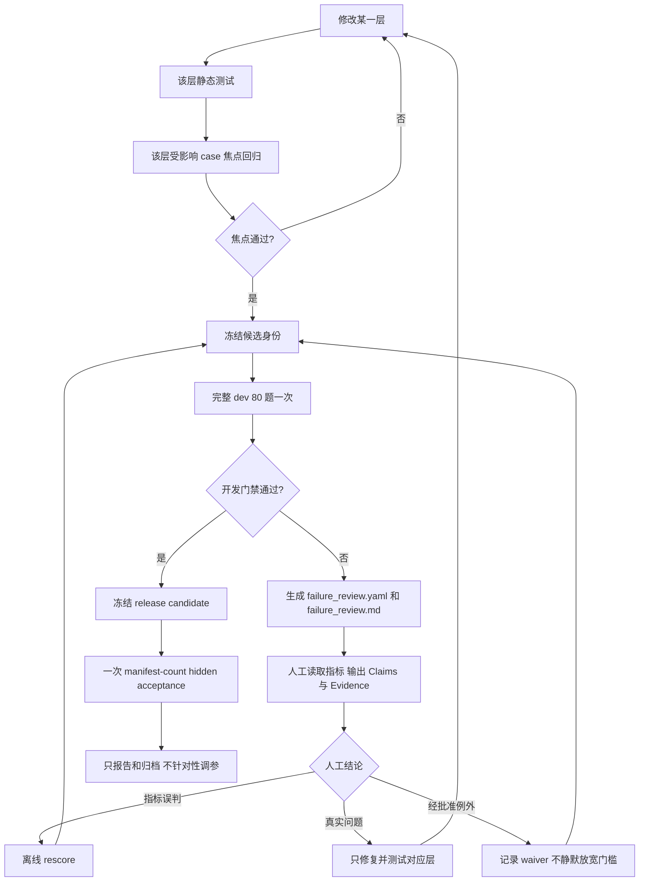

# M6 评估复盘：问题、优化、门禁状态与后续策略

> **当前配置说明（2026-08-03）：** runtime 已恢复为 `gemini-3.6-flash`。下文关于 Lite runtime、Docker/ADC 暂停和 Lite RC1 的描述均为历史回顾，不代表当前环境或模型状态。

> **Phase 1–5 后续状态（2026-08-02）：** 17 项人工失败审查已完成并实施；13 项离线 rescore、4 项真实修复均已处理。Benchmark v2 已将暴露题分成 80 dev / 24 challenge / 16 regression，并于 2026-08-02 完成 120/120 人工批准；旧 acceptance 退役，新的 blind acceptance 尚未创建。4 个真实失败案例的定向指标均达到 1.0 且无 major unsupported。详见 `docs/M6_PHASE1_5_IMPLEMENTATION.md` 和 `evaluation/benchmarks/v2/benchmark_manifest.json`。

> **Phase 6.0–6.7 当前状态：** runtime 改为 `gemini-3.5-flash-lite`，M6 evaluation judge 独立保持 `gemini-3.6-flash`；只计划运行完整 dev 和 16 题 regression，不运行 challenge 或 acceptance。Phase 6 当前因 Docker engine 权限和 Vertex ADC 缺失而暂停，详见 `docs/M6_PHASE6_0_7_RESULT.md`。未来 hidden acceptance 题数由独立 manifest 声明，当前 policy 为 64 题。

> 记录范围：从 M6 Gold Benchmark 建立开始，到 `m6-qa-dev-candidate-v8` 于 2026-08-02 被人工中断为止。  
> 事实来源：当前源码、`evaluation/gold_questions.yaml`、各 run 的 `manifest.json`、`metrics.json`、`records/*.json` 与 `report.md`。  
> 当前结论：retrieval 开发门禁已经达到；QA 开发门禁尚未正式确认；acceptance 从未运行。

## 1. M6 的目标和数据边界

历史 M6 初版曾使用 80 道开发集和 40 道 acceptance；该 acceptance 已因暴露而退役。当前签署的 v2 Gold 是 120 道暴露题：80 道 `dev`、24 道 `challenge`、16 道 `regression`。Gold 数据集 hash 为：

```text
2ed63e9af9df3c0dce0c1a71e046b5785e19e40d4292c1da8ba5d46a53b22034
```

开发集负责发现问题和迭代；acceptance 只用于冻结候选的最终验收。二者不能混用。尤其是：

1. acceptance 只能在代码、Prompt、模型配置、query expansion、retrieval policy 和 index identity 全部冻结后运行；
2. acceptance 结果不能用于针对性调参，否则它会退化为第二开发集；
3. acceptance 运行后的任何实现变化都必须创建新候选，重新经过焦点回归和完整 dev。

## 2. Retrieval 阶段出现的问题

### 2.1 初始门禁结果

第一次完整 retrieval 开发集 `m6-retrieval-dev-approved` 完成 80/80，没有未处理异常，但核心指标明显不足：

| 指标 | 初始结果 | 开发门槛 |
|---|---:|---:|
| Gold Evidence Recall@10 | 0.4500 | ≥ 0.85 |
| Intent accuracy | 0.8000 | ≥ 0.90 |
| Required-source coverage | 0.7875 | 1.00 |
| Wrong-version evidence | 0 | 0 |

这说明语料和索引可用，但查询规划、精确定位、来源平衡和 Gold 证据匹配还不可靠。

### 2.2 具体问题

1. **Gold selector 与实际 chunk 层级不一致。** Gold 标注可能指向页面或父章节，而检索返回子 section/chunk，导致内容正确但 Recall 计为未命中。
2. **Intent 路由不稳定。** 中文、混合语言和 identifier-heavy 问题容易被通用 LLM 分类带偏，尤其是 `usage`、`data_flow`、`algorithm_implementation` 和 `troubleshooting` 的边界。
3. **精确标识符被长查询稀释。** 将多个 symbol/path 与自然语言一次性送入 exact 检索，会让某些关键 symbol 没有进入前 10。
4. **来源相互挤占。** 高频代码、单篇长论文或同一路径的相邻 chunk 会占满候选，论文、workflow 或另一仓库的必要证据被排除。
5. **论文检索粒度不稳定。** 纯 dense 检索容易让同一论文占满结果，也可能返回语义相关但不是 Gold 章节的页。
6. **source budget 与精确 symbol 冲突。** 即使 exact 通道找到关键实现，最终配额和多样性限制仍可能把它剔除。
7. **workflow/graph 的词面不匹配。** 中文描述或领域别名与结构化 workflow 的英文规范名称不同，导致 workflow/graph 通道为空或偏离。
8. **环境故障与质量故障混在一起。** 受限 shell 的 ADC 不可见、Docker 权限和一次 PostgreSQL 端口冲突曾导致运行失败；这些不能被算作模型质量问题。

## 3. 为达到 Retrieval 门禁做的优化

### 3.1 Gold 与评估器

- `evaluation.py::evidence_group_recall()` 增加父对象 lineage 回溯，使页面级 Gold 可以匹配真实返回的子 section/chunk。
- 逐题保存 `ranked_object_ids`、各通道排名、融合分数、排除原因和最终 Evidence，避免只看一个总分而无法定位原因。
- 评估运行采用 `EvaluationRunStore` 原子 case 文件与 JSONL checkpoint，支持中断恢复。

### 3.2 Query planning 与 intent

- `retrieval.py::route_high_confidence_intent()` 使用配置化、高置信规则优先路由，未命中时再使用 Gemini analyzer。
- `configs/query_expansions.yaml` 保存经审核的概念、symbol/path、论文页提示和别名，不把领域知识硬编码在 Prompt 中。
- 增加 acceptance、efficiency、back propagation 等概念 scope，明确区分：
  - LMD → IP 与 Target Spectrometer → event POCA；
  - angular acceptance 与 longitudinal efficiency；
  - point-like acceptance 与 Restgas effective acceptance。

### 3.3 多路检索与融合

- exact 检索改为逐 symbol/path 轮询，并保留真实通道顺序。
- 为论文问题增加独立 paper 通道，按三篇论文分别召回，并支持 reviewed page hints。
- 保留 dense、sparse、workflow、graph 多路召回，采用 weighted RRF、来源预算、路径去重和多样性限制。
- 论文必需问题优先保留 reviewed paper anchors；实现/API 问题优先保留精确 code symbol。
- 被 query plan 明确列出的 exact symbol 设为 mandatory anchor，在 12 条 Evidence 上限内不再被普通 source/type cap 淘汰。
- workflow 和 curated graph 增加有界 fallback，解决中文或别名与结构化对象缺少词面交集的问题。

### 3.4 Retrieval 完整开发集结果演进

| Run | Recall@10 | Intent accuracy | Required-source coverage | Exceptions |
|---|---:|---:|---:|---:|
| `m6-retrieval-dev-approved` | 0.4500 | 0.8000 | 0.7875 | 0 |
| `...-v2` | 0.6798 | 0.8875 | 0.7625 | 0 |
| `...-v3` | 0.6694 | 0.9873 | 0.7848 | 1 |
| `...-v4` | 0.7579 | 0.9750 | 0.7500 | 0 |
| `...-v5` | 0.8746 | 1.0000 | 0.7375 | 0 |
| `...-v6` | 0.9813 | 1.0000 | 0.9625 | 0 |
| `...-v7` | 0.9792 | 0.9875 | 1.0000 | 0 |

`v7` 达到 retrieval 开发门禁：总体 Recall@10 和 intent accuracy 达标、required-source coverage 为 1.0、无 wrong-version evidence、无未处理异常。Recall 从 v6 到 v7 的轻微变化属于重排和模型非确定性范围，不改变门禁结论。

## 4. QA 阶段出现的问题

### 4.1 初始 QA 问题

第一次完整 QA 候选 `m6-qa-dev-candidate-v1` 的 retrieval 已很强，但答案层仍有明显问题：

- answer-point coverage 只有 0.5823；
- expected-status accuracy 只有 0.7722；
- 17 个 unsupported claims；
- 27 个 required identifier 缺失；
- 8 个 identifier hallucination；
- 1 个未处理异常。

主要原因不是“没有检索到”，而是“检索证据没有稳定转化为合格答案”。

### 4.2 具体问题

1. **Evidence sufficiency 过严或过松。** 有充分证据时可能错误拒答；精确数值或安装要求没有被语料支持时又可能给出确定性答案。
2. **模型省略 required identifier。** Evidence 中存在路径、class 或中间 ROOT 产品，但自然语言答案没有逐字写出。
3. **语义 judge 对 faithful paraphrase 误判。** Claim 中的解释性连接、双语转述或跨文件对比有时被 reviewer 标为 unsupported。
4. **真实 unsupported claim。** 部分回答把推断、路径缩写或论文设计意图写成当前实现事实，需要删除或缩窄。
5. **版本 scope 引用错误。** 例如 `scope_pandaroot` 曾引用 Sphinx Evidence，而不是对应 PandaRoot commit 的源码 Evidence。
6. **Answer-point judge 偏保守。** 回答实际涵盖 rubric，但 judge 返回空 coverage，造成大量 0 分。
7. **Wildcard identifier 计分边界。** `Lumi_Geane_*.root` 等是对源码中动态拼接文件名的合理概括，但字符串并未逐字出现在 Evidence，因此会被严格 identifier 指标标为 hallucination。
8. **运行环境瞬态故障。** Vertex、ADC 或 PostgreSQL 的偶发错误曾造成 exception；必须单题恢复，不能把它当作答案质量。

## 5. 为达到 QA 门禁做的优化

### 5.1 生成与引用约束

- `prompts.py::ANSWER_SYSTEM_PROMPT` 要求只生成 atomic factual claims，每条 claim 必须引用 Evidence ID。
- class、function、branch、path 必须保持 Evidence 中的精确拼写，不允许扩展或缩写不存在的标识符。
- 最终答案不再由模型自由改写，而由 `qa.py::render_verified_answer()` 从已验证 claims 确定性渲染。
- 实现/API/data-flow 问题要求在相关时写出 query plan 中的 exact symbol/path 和具体中间产物。

### 5.2 有界工作流和验证

- Evidence 不足时最多进行一次 targeted retrieval；验证失败最多 revision 一次，避免无界 ReAct。
- 对“精确 GPU 内存”等语料未给出确定值的问题增加确定性 sufficiency guard，正确返回 `insufficient_evidence`。
- 对检索到但模型省略的计划 symbol/path，`QAAgent._augment_planned_locators()` 添加最多 3 条由 Evidence 直接支持的 locator claim。
- 版本 scope claim 从锁定 manifest/commit 元数据生成，并要求引用对应 repository source version，避免用网页快照替代源码版本证据。
- verifier 对路径、symbol、跨仓库对比和完整源码 excerpt 建立可审计的确定性支持条件，再结合 Gemini evidence review；仍失败时只 revision 一次。
- Vertex 429/503 等瞬态错误采用有限重试；异常进入逐题记录。

### 5.3 评估稳定性

- judge Prompt 明确允许 faithful paraphrase、双语解释和分开的对比 claims。
- 对 version scope、workflow、factory、event_poca、profile、Sphinx 等可由明确锚点判定的 rubric，增加 `_deterministic_point_ids()`，降低 judge 随机漏判。
- required identifier、citation、version、forbidden evidence、source type 继续使用确定性指标，不交给 LLM 自行判断。

### 5.4 QA 完整开发集结果演进

| Run | Recall@10 | Final Recall@12 | Status accuracy | Answer coverage | Unsupported | ID hallucination | ID missing | Exceptions | Model calls | Tokens |
|---|---:|---:|---:|---:|---:|---:|---:|---:|---:|---:|
| `candidate-v1` | 0.9831 | 0.7511 | 0.7722 | 0.5823 | 17 | 8 | 27 | 1 | 527 | 5,367,163 |
| `candidate-v2` | 0.9850 | 0.8951 | 0.9744 | 0.6410 | 13 | 7 | 10 | 2 | 527 | 6,024,385 |
| `candidate-v3` | 0.9729 | 0.8867 | 1.0000 | 0.8000 | 6 | 2 | 5 | 0 | 490 | 5,177,375 |
| `candidate-v4` | 0.9833 | 0.8915 | 1.0000 | 0.8750 | 5 | 0 | 6 | 0 | 488 | 5,200,578 |
| `candidate-v5` | 0.9833 | 0.9510 | 1.0000 | 0.9125 | 5 | 1 | 0 | 0 | 498 | 6,067,814 |

`candidate-v5` 已满足 Recall、intent、status、citation、version、identifier rate、dual-source 和 answer coverage 等大多数阈值，但仍有 5 个 unsupported claims，因此 QA 开发门禁不能视为通过。

## 6. v5 之后的焦点修复与当前状态

v5 的主要阻塞 case 是：

| Case | 主要问题 |
|---|---|
| `g016` | `claim_1` 被判 unsupported |
| `g068` | intent 路由错误 |
| `g104` | wildcard 文件名被计为 identifier hallucination |
| `g109` | `scope_pandaroot` 引用了错误类型的 scope Evidence |
| `g110` | `claim_1` 被判 unsupported |
| `g116` | `claim_2` 与 locator claim 被判 unsupported |

之后只运行了上述受影响题，而没有立即重跑 80 题：

- `m6-qa-focused-v8-net`：6 题中 5 题完成，answer coverage、intent、citation、required source、unsupported-claim 检查均通过；`g116` 因 PostgreSQL 临时端口冲突未完成；
- `m6-qa-focused-v8b-net`：只重试 `g116`，通过且没有 unsupported claim；
- `g104` 的 4 个 wildcard 文件模式仍被严格字符串指标计为 hallucination。它们在 Evidence 中由字符串拼接明确形成，属于需要人工判断的“指标边界”，不能直接通过放宽全局门槛掩盖。

随后冻结候选并启动 `m6-qa-dev-candidate-v8`。用户在运行途中要求停止时，磁盘保留了 53 个原子 case 记录。2026-08-02 使用同一 run ID 恢复，只执行剩余 27 题并完成 80/80；因为 dev 问题 ID 与 acceptance ID 在 `g001`–`g120` 中交错，终端中的最大题号不能代表已完成的 dev 数量。

恢复前首次尝试因 PostgreSQL 未启动而在 manifest 构建阶段超时，没有产生新 case 或模型调用。启动 PostgreSQL/Qdrant 并通过 `panda-qa-index verify`（80,698 points，missing/stale 均为 0）后再次恢复成功。这验证了原子 checkpoint 对基础设施故障的隔离能力。

v8 完整结果为：

| 指标 | v8 结果 | 开发门槛 |
|---|---:|---:|
| Gold Evidence Recall@10 | 0.9771 | ≥ 0.85 |
| intent accuracy | 1.0000 | ≥ 0.90 |
| expected status accuracy | 0.9875 | ≥ 0.95 |
| citation integrity | 1.0000 | = 1.00 |
| answer-point coverage | 0.9375 | ≥ 0.85 |
| paper+code 双来源 | 1.0000 | = 1.00 |
| identifier hallucination rate | 0.00545 | < 0.03 |
| wrong-version Evidence | 0 | = 0 |
| unsupported claims | 5 | = 0 |
| required identifier missing | 1 | = 0 |
| required-source coverage（answered） | 0.9873 | = 1.00 |
| unhandled exceptions | 0 | = 0 |

因此 v8 仍未通过 QA 开发门禁。自动生成的人工审查表覆盖 17 个含阻塞或诊断信号的 case；明确阻塞项集中在 `g001`、`g003`、`g013`、`g016`、`g021` 的 unsupported claims，以及 `g112` 的错误拒答、required source 缺失和 required identifier 缺失。其余非满分项目仍需人工判断是实际问题还是指标边界。

## 7. QA 门禁仍需完成的工作

1. **先完成人工审查，不立即修复。** v8 已完成 80/80 且开发门禁失败；必须先编辑 `data/evaluation/runs/m6-qa-dev-candidate-v8/failure_review.yaml`，逐题阅读模型输出与 cited Evidence。
2. **为每个条目给出可审计结论。** 区分：
   - `metric_false_positive`：评估器误判，处理为 `rescore`；
   - `real_failure`：检索或 QA 的真实问题，处理为对应层的 `fix`；
   - `acceptable_exception`：有明确理由且经批准的例外，处理为可审计 `waiver`。
3. **优先检查 v8 的阻塞项。** 先核对 5 个 unsupported claims 与 `g112` 的错误拒答、来源覆盖和 identifier；需要区分 reviewer 偏保守、Gold selector 不完整与真实回答错误。
4. **检查 identifier 规则。** 不应把合理的文件族表示与真正虚构路径混为一谈；任何修改应先由人工审查证明是指标误判，再离线 rescore，而不是重新调用 QA 模型。
5. **环境错误单独恢复。** ADC、网络、数据库连接或 rate limit 只重试失败 case，不扩大评估范围。
6. **QA dev 通过前不运行 acceptance。** 当前暴露 v2 不可作为 acceptance；未来 hidden acceptance 的题数必须从独立 manifest 读取。其结果不得用于调参。

## 8. 新的修复闭环



这套闭环的核心规则是：

> 修改哪一层，就只重新运行受影响的那一层；完整 80 题只用于冻结候选版本。

该策略已经落实到真实代码，而不只是文档约定：

| 实现 | 代码位置 | 作用 |
|---|---|---|
| mode-aware 开发门禁 | `src/panda_agent/evaluation.py::evaluate_development_gate` | retrieval 与 QA 使用各自适用的指标；焦点/partial run 不能伪装成完整冻结候选 |
| 失败结果表生成 | `src/panda_agent/evaluation_runner.py::write_failure_review` | 从已有 records 离线生成 YAML canonical 表和 Markdown 快照，不调用 Vertex |
| 审核表校验 | `src/panda_agent/evaluation_runner.py::validate_failure_review` | 未填写 classification/action/rationale/reviewer/time 时拒绝进入修复 |
| CLI | `src/panda_agent/cli/evaluate.py` 的 `review` 子命令 | `review --run-id ...` 生成表，`review --check` 验证人工决策完整性 |
| 回归测试 | `tests/unit/test_m6_evaluation.py` | 验证开发门禁、表格内容、pending 决策拒绝与 resume 一致性 |

当前 v8 审查入口：

```powershell
# 阅读 Markdown 快照并编辑 YAML canonical 表
notepad data\evaluation\runs\m6-qa-dev-candidate-v8\failure_review.yaml

# 人工填写完成后执行；未完成时非零退出
..\.venv\Scripts\panda-qa-eval.exe review `
  --run-id m6-qa-dev-candidate-v8 --check
```

详细执行策略见 `docs/EVALUATION_POLICY.md`，人工表字段和审核方法见 `evaluation/GOLD_REVIEW_GUIDE.md`。
