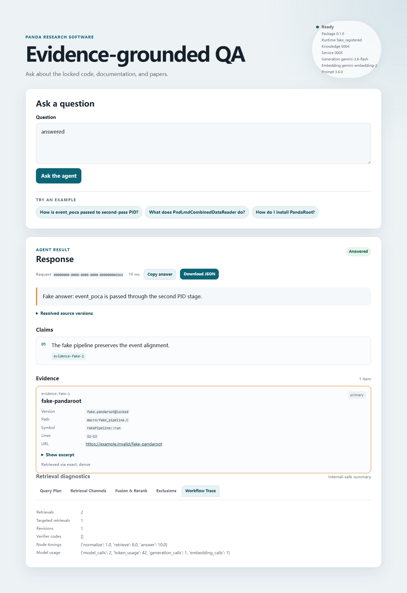

# M8 Overall 验收结果

**验收日期：** 2026-08-11  
**状态：** `M8 overall PASS`  
**里程碑：** `M8 complete`

本文记录 M8 P0/P1 合并后的当前本机 UI 验收。它证明的是 loopback-only、单进程、单次
问答的服务端渲染 UI 和诊断边界，不是公开部署、生产安全认证或多用户产品。

## 1. 验收范围

当前 `panda-qa-api` 在一个 FastAPI 进程内初始化一次 `QAService`，并提供：

| 方法 | 路径 | 说明 |
|---|---|---|
| `GET` | `/` | 307 → `/ui` |
| `GET` | `/ui` | Jinja2 主页面，health partial 由 HTMX 加载 |
| `POST` | `/ui/qa` | urlencoded、同源校验后调用共享 `QAService`，返回 HTML partial |
| `GET` | `/ui/health` | 安全运行状态 partial，ready/未 ready 分别为 200/503 |
| `POST` | `/v1/qa` | 既有 JSON QA 接口 |
| `POST` | `/v1/qa/diagnose` | 同一次执行返回脱敏诊断、节点 timings 和 model usage |

UI、JSON API 和 diagnose endpoint 都走同一 readiness probe、进程内 gate 和
`QAService.execute(question)`；页面只渲染该次 envelope，不重复检索或生成。结果诊断
包含五个 tabs：Query Plan、Retrieval Channels、Fusion & Rerank、Exclusions、Workflow
Trace。当前结果支持 Copy answer 和 Download JSON。

实现使用 Jinja2 默认 autoescape、固定本地 HTMX **2.0.7**、同源 `Origin` 检查、CSP、
`nosniff`、`no-referrer` 和 HTTPS-only 外部 evidence links。服务仍只监听 loopback，
不提供多轮会话、账户、远程访问、上传、代码/命令执行、Coding/Debug Agent 或公开部署。

## 2. 确定性验证

| 检查 | 结果 |
|---|---:|
| 全部 `tests/unit` | **198/198** |
| UI 单元（`tests/unit/test_ui.py` + `test_ui_assets.py`） | **11/11** |
| diagnostics 单元（`tests/unit/test_diagnostics.py`） | **3/3** |
| 真实 Microsoft Edge Playwright E2E（`tests/e2e/test_ui_playwright.py`） | **1/1** |
| `python -m compileall -q src tests\unit tests\e2e tests\live` | 通过 |
| `python -m pip check` | 通过 |
| `git diff --check` | 通过 |

Edge E2E 启动真实 loopback Uvicorn 并使用安装的 Microsoft Edge；它用 fake service，
不初始化真实数据库、Qdrant 或 Vertex。测试覆盖 HTMX swap、五个 tabs 与键盘导航、
证据定位焦点、复制、JSON 下载、CSP/安全响应、领域状态、错误 partial 和窄屏布局。

截图：



## 3. 八意图真实 UI smoke

以下为最新一次经授权的真实 `/ui/qa` smoke。每行均为唯一最新 `qa_runs` 记录：状态为
`answered` 且已完成，`intent` 与 Gold 预期一致，`error_code` 为 `null`，
`node_timings`/`model_usage` 非空，`verification_error_codes` 为空，claims/evidence
非空，所有 evidence 的 source version 均在锁定版本集合内。

| Case | 预期 intent | 最新 request ID | duration_ms |
|---|---|---|---:|
| `g001` | `installation` | `54933e2a-0492-4cd8-b442-c88335d82b29` | 56455 |
| `g013` | `usage` | `4ae8a76d-f957-4261-8e88-51eb632cc146` | 30744 |
| `g027` | `api` | `a84fba56-4e74-4b37-95cd-15d67b1bfc70` | 46511 |
| `g051` | `algorithm_theory` | `e30d35c5-b3e3-47c0-ae99-fe37707c0722` | 62813 |
| `g070` | `algorithm_implementation` | `05405a70-0c7d-4404-837b-53d779cb1440` | 40671 |
| `g090` | `data_flow` | `1eeb8081-2766-4ad0-b8a8-aeffdcd92303` | 84007 |
| `g105` | `module_structure` | `5ec64ae9-8465-498f-b46c-d5952cb1fd7e` | 44181 |
| `g112` | `troubleshooting` | `502b37f5-4124-4ec0-83f3-43bc46b8b50a` | 80889 |

### g090 的确定性 adjudication

live harness 的来源分类曾把 `g090` 判成缺少来源类型。离线确定性 adjudication 检查了
该请求最终选择的 evidence 与公开诊断：其中包含 Sphinx 文档对象、PandaRoot/Restgas
源代码对象和 workflow 对象，满足 `data_flow` 的来源覆盖。该结论由已保存的选择结果和
锁定语料对象决定，没有重新调用模型，也没有改写原始请求记录。

## 4. 审计失败保留与窄修复

原始失败 audit 记录保持不可变，未被通过记录覆盖：

| Case | 保留的失败 audit request ID | 窄修复边界 |
|---|---|---|
| `g051` | `fd6c9634-918e-4de9-aad9-d846817c1382` | theory 查询不额外要求 factory application；只有明确询问 factory construction/application 才启用该门禁 |
| `g090` | `dcb3a9e6-183b-4ea1-9b75-06243c206179` | event-ID/PID alignment 不额外要求完整 workflow order；只有明确要求完整顺序才强制该约束 |
| `g105` | `28106aa8-6a4f-4ecb-a9ee-67b0bbce79fd` | directory mapping 不额外要求 factory composition；只有明确询问 factory composition 才强制该约束 |
| `g112` | `ec909934-e742-4f41-8afc-200770730613` | 明确的 accepted/generated accounting 不推断 empty-bin efficiency diagnosis；只有明确询问 empty-bin efficiency 才启用该门禁 |

这些修复只收窄了问题分类与门禁触发条件，不删除失败审计，也不把内部诊断或完整
Prompt/evidence 正文写入文档。

## 5. 可复现 live harness 与授权边界

入口是 `tests/live/test_m8_ui_live.py`，冻结 case 集合为上述八题；默认运行跳过：

```powershell
python -m unittest tests\live\test_m8_ui_live.py -v
```

设置 `PANDA_RUN_LIVE_M8_UI=1` 才会启动真实 loopback 服务、Microsoft Edge、Vertex AI，
并为每题写入一条 `qa_runs`；可选 `PANDA_M8_LIVE_CASE_IDS` 传入八题的唯一子集，例如：

```powershell
$env:PANDA_RUN_LIVE_M8_UI = '1'
$env:PANDA_M8_LIVE_CASE_IDS = 'g001,g013'
python -m unittest tests\live\test_m8_ui_live.py -v
```

因此 live 测试是可复现且显式 opt-in 的外部副作用操作：它会把相关问题和锁定语料片段
发送至 Vertex，并写入 `qa_runs`，必须有明确授权；默认跳过不构成失败或通过。

## 6. 结论和边界

P0 的 UI/API 共享执行、P1 的健康 partial/诊断 endpoint、五 tabs、复制/下载、真实 Edge
E2E、截图和经授权的八意图 live harness 均已完成，全部验收证据与当前源码一致。因此
当前结论为：

```text
M8 overall PASS
M8 complete
```

该结论不扩展为多轮、账户、远程、上传、Coding/Debug Agent、公开部署或生产 TLS/鉴权能力。
