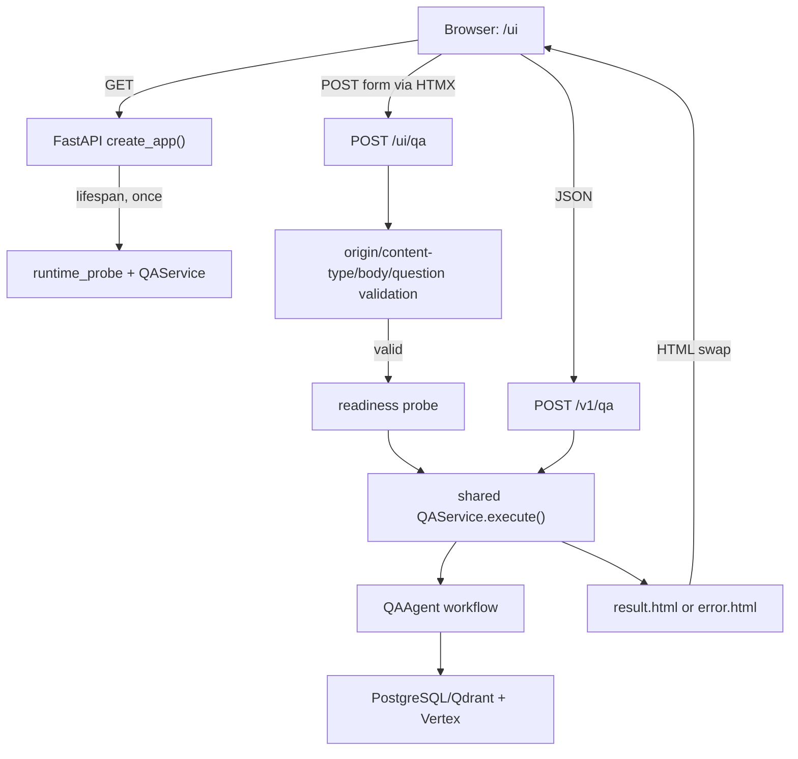

# M8 P0：Web UI 实施记录

> 状态：P0 已实现并完成确定性验证；P1 已在后续阶段完成，M8 overall 已通过且 M8
> complete。本文件保留 P0 阶段的实现边界、验证结果和当时 backlog；当前 P1 与整体结论见
> [`M8_P1_IMPLEMENTATION.md`](M8_P1_IMPLEMENTATION.md) 和 [`M8_OVERALL_RESULT.md`](M8_OVERALL_RESULT.md)。

## 1. 目标与边界

M8 P0 为已经通过 M7 验收的本机 FastAPI 服务增加一个服务端渲染的问答页面：

- FastAPI 返回 Jinja2 HTML；
- HTMX 2.0.7 只负责把 `/ui/qa` 的 HTML partial 更新到当前页面；
- UI 与 `/v1/qa` 共用同一个进程、同一个 `QAService` 和同一个进程内并发 gate；
- 结果页展示回答、结构化 claims、可定位的 evidence 以及少量安全的诊断摘要。

P0 明确不是完整前端平台：不提供多轮会话、账户、上传、代码修改、命令执行、
远程访问、服务端 UI 历史或独立 Node/React 构建链。UI 不改变既有 QAAgent、
检索、版本锁定和引用验证逻辑。

## 2. 架构与请求流程



`src/panda_agent/api.py::create_app()` 在 lifespan 中只初始化一次服务。`/ui/qa`
和 `/v1/qa` 都把实际执行交给同一个 `QAService`；UI 层只负责表单解析、错误
映射和 HTML 渲染，不复制 Agent 的检索或生成流程。服务执行仍通过
`run_in_threadpool()`，因此同步的 QA 工作不会阻塞 FastAPI 事件循环。

一次 UI 请求的顺序是：

1. 浏览器打开 `/ui`，得到 `ui.html`、本地 CSS、JS 和 HTMX 资源。
2. HTMX 以 `application/x-www-form-urlencoded` 向 `/ui/qa` 提交 `question`。
3. API 检查可选的 `Origin` 是否与当前请求同源、内容类型、请求体上限和问题长度。
4. 通过 readiness probe 后，调用共享 `QAService.execute(question)`。
5. 成功时返回 `templates/partials/result.html`；`answered`、
   `insufficient_evidence` 和 `version_conflict` 都是 HTTP 200 的领域结果。
6. 传输/基础设施错误返回 `partials/error.html`，HTMX 仅替换 `#qa-result`，不会再次
   运行检索。

## 3. 路由与文件映射

### 3.1 P0 UI 路由

| 方法 | 路径 | 当前行为 |
|---|---|---|
| `GET` | `/` | 307 重定向到 `/ui` |
| `GET` | `/ui` | 返回 `templates/ui.html` 主页面 |
| `POST` | `/ui/qa` | 校验 urlencoded 表单并返回结果或错误 partial |
| `GET` | `/static/...` | 返回本地 `ui.css`、`ui.js` 和 HTMX 资源 |

既有 M7 JSON API 仍可用：`/health/live`、`/health/ready`、`/version`、
`/v1/qa`、`/docs` 和 `/openapi.json`。在 P0 快照时尚未实现 `/ui/health` 或
`/v1/qa/diagnose`；它们已在 M8 P1 落地，当前行为见
[`M8_P1_IMPLEMENTATION.md`](M8_P1_IMPLEMENTATION.md)。

### 3.2 代码和资源

| 文件 | 作用 | 工作流位置 |
|---|---|---|
| `src/panda_agent/api.py` | `create_app()`、UI/API 路由、headers、表单解析和安全诊断投影 | FastAPI 边界 |
| `src/panda_agent/cli/api.py` | `panda-qa-api` 启动、`.env` 加载、loopback host 和 Uvicorn `workers=1` | 进程入口 |
| `src/panda_agent/templates/base.html` | autoescape 默认模板、CSP meta、同源 HTMX 和静态资源引用 | HTML 基础布局 |
| `src/panda_agent/templates/ui.html` | 问题输入、示例问题、HTMX 表单和结果容器 | 主页面 |
| `src/panda_agent/templates/partials/result.html` | status、answer、claims、evidence、locator 和安全诊断摘要 | 成功 partial |
| `src/panda_agent/templates/partials/error.html` | 400/403/422/429/500/503/504 的脱敏提示 | 错误 partial |
| `src/panda_agent/static/ui.css` | 本地响应式样式和基础键盘焦点样式 | 静态资源 |
| `src/panda_agent/static/ui.js` | 示例问题填充；不发起网络请求 | 静态资源 |
| `src/panda_agent/static/vendor/htmx.min.js` | 固定的 HTMX 2.0.7 本地副本 | 静态资源 |
| `tests/unit/test_ui.py` | UI route、共享 Service、escaping、origin、headers 和错误契约 | 确定性测试 |

## 4. 资源与依赖

`pyproject.toml` 的 `qa` extra 已包含 `fastapi`、`jinja2` 和 `uvicorn`；不需要
Node、npm 或单独的前端构建。`tool.setuptools.package-data` 将
`templates/**/*.html` 与 `static/**` 打进 Python wheel，构建后的包不依赖源码目录
旁边的临时文件。HTMX 通过 `static/vendor/htmx.min.js.LICENSE.txt` 标记为 2.0.7，
运行时不访问 CDN。

运行问答仍需要 M7 的本地 PostgreSQL/Qdrant、已恢复并注册的 Knowledge Bundle、
Application Default Credentials 和 Vertex 配置；Web UI 只是展示层，不替代这些依赖。

## 5. 安全模型

P0 的安全边界是“本机只读问答展示”，不是公开部署安全机制：

- `panda-qa-api` 拒绝非 loopback host；默认监听 `127.0.0.1:8000`，Uvicorn `workers=1`。
- UI 只接受 `application/x-www-form-urlencoded`，请求体最多 65,536 bytes，问题最多
  10,000 个字符；未知字段会被拒绝。
- 若请求携带 `Origin`，`_same_origin()` 必须匹配当前 scheme/netloc，否则返回 403。
- Jinja2 默认 autoescape；模板没有使用 `|safe`。用户问题、模型回答、claim、evidence
  文本和 locator 都按不可信文本输出，HTML/脚本不会被执行。
- Evidence locator 只有 `https://` 才生成新窗口链接，并带
  `rel="noopener noreferrer"`；`http://` 和 `file://` 只显示文本。
- 中间件为除 `/docs` 外的响应加入 CSP（`default-src 'self'`、同源 script/style/
  connect、禁止 object/frame/base 外联）、`X-Content-Type-Options: nosniff` 和
  `Referrer-Policy: no-referrer`。页面自身也声明同样的 CSP meta。
- UI 诊断只投影 `intent`、`routing_method`、retrieval/targeted/revision counts；
  不把 system prompt、完整 evidence、内部 claim audit、ADC、凭据或异常堆栈放入 HTML。

P0 不提供身份认证、TLS、CORS、用户隔离、跨进程 gate 或远程访问白名单。不要把
loopback prototype 直接暴露到局域网或公网。

## 6. 状态、错误与响应

领域结果不是 HTTP 错误：

| 领域状态 | HTTP | 页面表现 |
|---|---:|---|
| `answered` | 200 | Answered badge、claims 和 evidence |
| `insufficient_evidence` | 200 | Insufficient evidence badge，可显示已验证的有限信息 |
| `version_conflict` | 200 | Version conflict badge，不输出不匹配版本的确定性答案 |

UI 传输/服务错误：

| HTTP | `error_code` | 典型原因 |
|---:|---|---|
| 400 | `bad_request` | 非 urlencoded、body 超限或格式错误 |
| 403 | `origin_forbidden` | `Origin` 不是当前页面同源 |
| 422 | `validation_error` | 空问题、超过 10,000 字符或未知表单字段 |
| 429 | `busy` | 进程内并发 gate 已被占用 |
| 500 | `internal_error` | 已脱敏的内部服务错误 |
| 503 | `service_unavailable` | runtime 未注册或 readiness 失败 |
| 504 | `deadline_exceeded` | 达到 `PANDA_QA_DEADLINE_SECONDS` |

成功结果中的 claims 通过 evidence ID 锚点跳转到 evidence 卡片；Evidence 的正文默认
折叠。UI 不保存会话历史，刷新页面只会回到空白表单。

## 7. 安装、启动与使用

以下是新用户获得代码和预构建 Bundle 后的最短路径。它不会重新 parsing、embedding
或 indexing：

```powershell
Set-Location .\PANDA_Agent
..\.venv\Scripts\python.exe -m pip install -e ".[qa]"
Copy-Item .env.example .env

# 先只启动空的基础设施，不启动会自动迁移或初始化应用数据的服务。
docker compose up -d postgres qdrant --wait

$bundlePath = 'D:\panda-bundles\panda-kb-prototype-v2.0.0'
panda-qa-kb restore --bundle $bundlePath --project-root (Get-Location)
panda-qa-kb verify --bundle $bundlePath --project-root (Get-Location)
python -m alembic upgrade head
panda-qa-runtime register-runtime --bundle $bundlePath --project-root (Get-Location)
panda-qa-runtime verify --project-root (Get-Location)
panda-qa-api --project-root (Get-Location)
```

看到服务启动后，在浏览器打开：

```text
http://127.0.0.1:8000/ui
```

输入问题并点击 **Ask the agent**。也可以用 M7 JSON API 验证同一个服务：

```powershell
Invoke-RestMethod http://127.0.0.1:8000/v1/qa -Method Post `
  -ContentType 'application/json' `
  -Body (@{question='How is event_poca passed to second-pass PID?'} | ConvertTo-Json)
```

停止本机 API 使用 `Ctrl+C`；基础设施是否停止由用户决定，测试环境可执行
`docker compose down`。若 `panda-qa-kb verify` 在注册前显示
`runtime_status=not_registered`，只要 Knowledge Bundle 验证仍为 `valid=true` 即可继续；
最终应以 `panda-qa-runtime verify` 的 `runtime_status=registered` 为准。

## 8. P0 阶段确定性验证（历史快照）

P0 阶段的验证不声称真实 Vertex 或浏览器端到端通过；这只是 P0 当时的证据快照，
不覆盖后续 P1 的 198/198、Edge 1/1 和真实八意图 smoke：

- `tests/unit/test_ui.py`：6/6 通过，覆盖主页面/静态资源、API/UI 共享一次 Service、
  三种领域状态、HTML escaping/HTTPS locator、安全输入与错误响应、CSP headers；
- M7 相关 `test_api.py`：13/13 通过；
- `python -m compileall -q src`：通过；
- `python -m pip check`：通过；
- `git diff --check`：通过；
- 已检查构建 wheel 包含 templates、CSS、JS 与本地 HTMX 资源。

P0 当时没有调用 Vertex、没有运行 Playwright，也没有声称 real UI smoke 或视觉验收通过。
后续完成的整体证据见 [`M8_OVERALL_RESULT.md`](M8_OVERALL_RESULT.md)。

## 9. 故障排查

### 页面返回 503

检查 `docker compose ps`、Bundle restore、`panda-qa-kb verify`、Alembic migration 和
`panda-qa-runtime verify`。runtime 未注册时不要通过修改 UI 绕过 readiness。

### 页面返回 429

这是单进程并发限制。等待当前问题完成后再提交；不要通过增加 Uvicorn workers 期待
共享同一个 gate。`PANDA_API_MAX_CONCURRENCY` 只影响一个进程内的 gate。

### 页面返回 400/422

UI endpoint 不是 JSON API，必须由页面/HTMX 发送 urlencoded `question`；问题不能为空，
且不能超过 10,000 字符。直接用 JSON 调用请使用 `/v1/qa`。

### 页面返回 403

浏览器请求携带了非当前页面的 `Origin`。从服务自己的
`http://127.0.0.1:8000/ui` 打开页面，不要把表单请求转发到其他 host。

### 页面返回 504

这表示服务端 deadline 已锁存。查看 API JSON 日志和 `qa_runs`，确认 worker 是否随后
完成 cleanup；适当调整 `PANDA_QA_DEADLINE_SECONDS` 前，应先确认模型/依赖是否正常。

### CSS 或 HTMX 资源加载失败

确认是从安装后的 `panda_agent` 包运行，而不是只复制了 Python 文件；重新执行
`pip install -e ".[qa]"`，并直接检查 `/static/ui.css` 和
`/static/vendor/htmx.min.js` 是否 HTTP 200。

## 10. P0 历史边界与已关闭的 M8 P1 backlog

以下条目是 P0 写成时的待办快照；M8 P1 已完成并由
[`M8_P1_IMPLEMENTATION.md`](M8_P1_IMPLEMENTATION.md) 与
[`M8_OVERALL_RESULT.md`](M8_OVERALL_RESULT.md) 验证：

1. 完整诊断 tabs：Query Plan、retrieval channels、fusion/rerank、exclusions 和 workflow trace；
2. `/ui/health` partial 与 `/v1/qa/diagnose` 本地诊断 API；
3. 浏览器端复制答案、下载当前 JSON 和结果交互；
4. Playwright/browser smoke、真实 UI smoke 和截图视觉验收；
5. 键盘导航、窄屏/桌面布局和表单可用性审查；
6. 多轮会话、账户、远程部署、认证/TLS、跨进程并发与服务端 UI 历史仍是明确的非目标，
   不属于 M8 完成声明。

因此当前里程碑只能写作：

```text
M8 P0 implemented and deterministically verified
M8 P1 implemented and deterministically verified
M8 overall PASS
M8 complete
M7 overall PASS
```
